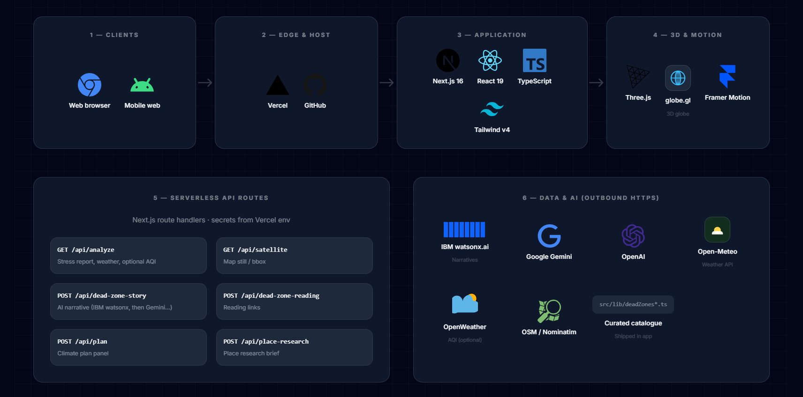

# EarthPulse

## System architecture



The same diagram also renders as a page at **`/architecture`** (e.g. [earthpulse-three.vercel.app/architecture](https://earthpulse-three.vercel.app/architecture)).

---

Somewhere on this planet, a forest that stood for a thousand years is gone. A sea that fed millions is dead. A city is breathing air that no government dashboard will tell you about.

### The story

Most of us only meet these places as a headline, a chart, or a number that scrolls away. I wanted one small surface where the harm stays **visible** — where you have to **look** at the same patch of Earth twice, years apart, and sit with what changed. EarthPulse is that bet: orbit first, guilt second, denial harder.

### What I built

**EarthPulse** is a **Next.js** app with a **3D globe** (**globe.gl** + **Three.js**). **Red pins** mark real stressed sites (climate, deforestation, industry, war, pollution, and similar). **Tap a pin** → the camera **dives** to a **detail page** with a **before/after** satellite-style slider, facts, a **written narrative** and read-further links, plus a short **“what still moves near this pin”** brief. **Search a city** to open a **local stress report** with signals like air quality and green cover, and a fork-style plan panel. It does **not** invent damage in a simulator — it **surfaces real places** and asks you to carry what you saw.

---

## What it does

Spin the globe. Somewhere you'll notice a red dot — maybe over the Aral Sea, maybe over a rainforest that no longer exists, maybe over a place you've never heard of. Tap it. The globe dives in. Real satellite imagery loads — a before and after, pulled from orbit — showing you exactly what was lost and when.

These are real places. Real damage. Done by climate change, global warming, war, pollution, and human decisions that nobody reversed. EarthPulse doesn't simulate anything. It just shows you what we did to our own planet, and asks you to look at it.

---

### IBM technology

Narratives use **IBM watsonx.ai**.

---

## Running it

```bash
npm install
npm run dev
```

Open `http://localhost:3000`.

---

## API keys (all optional)

Create `.env.local` in the project root. The app runs without any keys — keys unlock richer data, narratives, and research.

```bash
IBM_CLOUD_API_KEY=       # IBM watsonx (with WATSONX_PROJECT_ID)
WATSONX_PROJECT_ID=
GOOGLE_GEMINI_API_KEY=   # other AI routes, optional
OPENWEATHER_API_KEY=
OPENAI_API_KEY=
```

---

## Stack

Next.js · TypeScript · Tailwind CSS · Framer Motion · globe.gl · three.js · **IBM watsonx.ai** · Open-Meteo · OpenWeather · Nominatim

---

## Deploy

Push to GitHub, import into [Vercel](https://vercel.com/new), add your env vars under Settings → Environment Variables. Done.

---

**Live demo:** https://earthpulse-three.vercel.app

Built for the **Build for the Planet** hackathon.
